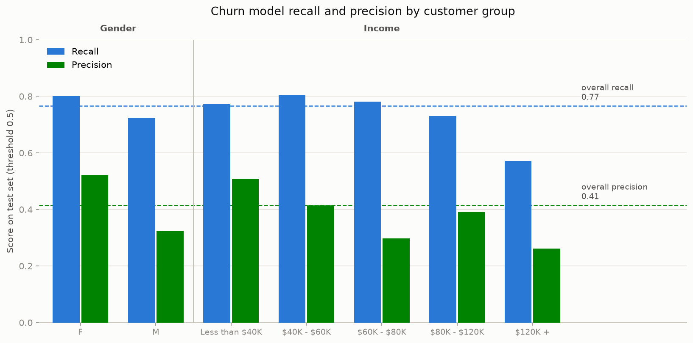

# Bank Churn Model

Flags credit card customers likely to leave, sizes the outreach list to the retention team's capacity, and audits whether the model treats customer groups equitably. Ships as a small package with a training entrypoint, a saved model artifact, a prediction CLI with reason codes, a drift check, and tests that run in CI.

[](https://github.com/marinasofia/bank-churn-model/actions/workflows/ci.yml)
[](pyproject.toml)
[](LICENSE)

## Quickstart

Requires Python 3.12 or newer. Run from the checkout; the default artifact paths
depend on it. The sample scores the committed dataset with the committed model.
It demonstrates the CLI, not a fresh held-out evaluation.

```bash
git clone https://github.com/marinasofia/bank-churn-model.git
cd bank-churn-model
python3 -m venv .venv
.venv/bin/python -m pip install -e ".[dev]"
mkdir -p outputs
.venv/bin/python -m churn.predict bankchurners_clean.csv --capacity 900 --out outputs/outreach.csv
.venv/bin/python -m pytest -q
```

Expect 900 selected rows plus a CSV header and per-feature drift statistics.
Only load artifacts you trust: joblib model loading executes Python object
deserialization. No API key or external service is required by this example.

## Architecture

`CSV -> contract -> features -> saved scaler/model -> drift gate -> ranked CSV`
is the scoring path. `churn/train.py` builds the artifact bundle and evaluation
metrics. The separate `audit/fairness_audit.py` evaluates the saved test split.
Notebooks retain the exploratory history; the package supplies reusable code.

## The decisions that matter

**The threshold is a capacity decision, not a modelling one.** The model outputs probabilities. `python -m churn.predict batch.csv --capacity N` returns the N customers most likely to churn, and the capacity curve below says what share of churners that catches. A team that can make 900 calls a month gets a different list from a team that can make 300, and neither needs to know what a threshold is.

**Logistic regression is shipped even though gradient boosting scores higher, and the gap is written down.** On the same held-out split, HistGradientBoosting with default settings reaches AUC 0.921 against 0.871 for logistic regression, and catches 87% of churners at 600 flagged against 77%. That is a real gap. I kept logistic for now because its coefficients are what make the per-customer reason codes possible ("low transaction count, repeated contacts with the bank"), and a reason is what a retention agent acts on. The honest next step is either to ship gradient boosting with SHAP-style reasons or to accept the recall cost in exchange for a model a compliance reviewer can read in one line. The numbers to make that call with are in `artifacts/metrics.json` under `comparison`.

**Class weighting, not SMOTE.** At 16% positives an unweighted model is accurate and useless. `class_weight="balanced"` reweights inside the loss with no synthetic rows and nothing new to tune.

**Fairness is audited on the saved artifact, not on a rebuilt model.** Gender and income are not features. `audit/fairness_audit.py` loads `artifacts/model.joblib` and the saved test rows and measures recall, precision, and selection rate per group, because excluding an attribute does not stop behavioural features from acting as proxies for it.

## Results

Test set: 2,026 customers, 325 churners. The current training script reports feature ranking and cross-validated capacity curves from training rows. The feature list was chosen after exploratory analysis of this dataset, so these results do not establish an untouched historical holdout. A new external or temporal evaluation remains necessary.

| | Logistic regression (shipped) | HistGradientBoosting | Rank by transaction count, no model |
|---|---|---|---|
| ROC-AUC on test | 0.871 (95% bootstrap CI 0.850 to 0.892) | 0.921 | 0.792 |
| Recall at 900 flagged | 0.889 | 0.945 | 0.883 |
| Recall at 600 flagged | 0.766 | 0.874 | 0.723 |
| Recall at 300 flagged | 0.569 | 0.655 | 0.252 |

Capacity curve for the shipped model, 5-fold cross-validated on the training set and stated per 2,026 customers scored (the test-set numbers at the same capacities are within two points of these):

| Customers flagged | Recall | Precision |
|---|---|---|
| 300 | 0.581 | 0.631 |
| 450 | 0.720 | 0.521 |
| 600 | 0.808 | 0.439 |
| 750 | 0.862 | 0.374 |
| 900 | 0.909 | 0.329 |

Standardised coefficients: transaction count is the dominant signal (-1.355), then revolving balance (-0.634), quarter-over-quarter transaction change (-0.584), months inactive (+0.500), and contact count (+0.498). Customers who transact less, carry no revolving balance, go inactive, and contact the bank repeatedly are the ones leaving.

On feature selection: the five features are the three strongest negative and the two strongest positive correlations with churn on the training rows. `Avg_Utilization_Ratio` ranks fifth by absolute correlation but is 0.62 correlated with revolving balance, which is already in. The ranking on training rows has the same order as on the full file, so moving selection inside the split changed nothing about the feature set, and now that is a recorded fact rather than an assumption.

## Fairness audit

`audit/fairness_audit.py` audits the shipped artifact's test-set predictions across Gender and Income_Category at threshold 0.5 (600 flagged). Full numbers in [`audit/fairness_report.json`](audit/fairness_report.json).



- **Base rates:** women churn more than men (17.4% vs 14.6%, chi-squared p = 0.0002); income slices range from 13.5% to 17.3%, highest at both extremes (p = 0.015).
- **Equal opportunity difference** (recall gap): 0.079 by gender (F 0.80 vs M 0.72). By income it is 0.233, driven by the $120K+ slice, which has only 21 actual churners in the test set.
- **Demographic parity difference** (selection rate gap): 0.087 by gender, with men flagged more often (34.3% vs 25.6%), and 0.103 by income.
- **Precision by group:** lower for men (0.32 vs 0.52), so a larger share of flagged men are false alarms.

The gender gaps run in the opposite direction of the base rates, so this is model behaviour, not a reflection of the data. The intervention is a retention offer, not a credit decision, so the cost of the disparity is wasted outreach and unevenly missed churners. The audit is threshold dependent and must be re-run at whatever capacity the business deploys. `tests/test_fairness.py` fails CI if the gender recall gap at threshold 0.5 reaches 0.10.

## What breaks and what catches it

| Risk | Guard |
|---|---|
| Leakage columns reappear in a new extract | contract rejects any column starting with `Naive_Bayes` |
| Customer ID or a demographic column enters the features | test asserts the feature matrix is exactly `FEATURES` |
| Scaler fit on the wrong split | scaler lives inside the sklearn Pipeline; there is no separate transform step to get wrong |
| Model and audit drift apart | audit loads the artifact; there is one model definition |
| Scoring data drifts from training data | PSI per feature on every batch; warning above 0.2, refuses above 0.5 without `--force` |
| Retrain produces different numbers | CI retrains and compares to `metrics.json` |
| Income band spelled differently in new data | contract rejects values outside the known bands |
| A retrain widens the gender recall gap | fairness gate test fails the build at 0.10 |

## Repository guide

| Path | Contents |
|---|---|
| `churn/features.py` | feature list, target, forbidden prefixes, income order, reason text; the only place these are defined |
| `churn/contract.py` | input data contract used by train and predict; errors name the column |
| `churn/train.py` | split, training-row ranking of fixed features, pipeline fit, CV capacity curve, bootstrap CI, comparison models, writes artifacts |
| `churn/predict.py` | score a CSV, apply capacity or threshold, write reason codes, drift gate |
| `churn/drift.py` | PSI between training bins and a scoring batch |
| `artifacts/` | `model.joblib`, `metrics.json`, `test_index.json`, `feature_bins.json` |
| `audit/fairness_audit.py` | per-group metrics from the artifact; writes the report and figure |
| `bankchurners_cleaning.ipynb` | raw Excel to clean CSV: leakage removal, missing values, types |
| `bankchurners_eda.ipynb` | churn rates by segment, correlation ranking, top-5 distributions |
| `bankchurners_model.ipynb` | the original notebook walk-through of the split, scaling, and threshold sweep |
| `tests/` | contract, leakage, reproducibility, evaluation, prediction, drift, fairness gate |

## Run

After the quickstart, train into a separate directory to preserve the committed
reference bundle:

```bash
.venv/bin/python -m churn.train --out outputs/retrained
.venv/bin/python -m churn.predict bankchurners_clean.csv --artifacts outputs/retrained --capacity 900 --out outputs/retrained-outreach.csv
```

For your own batch, supply a CSV with `CLIENTNUM` and the columns defined in
[churn/features.py](churn/features.py). Use unique, nonmissing IDs, finite
numeric features, a positive integer capacity, or a threshold from 0 to 1.
The current contract does not reject every invalid case yet. `--force` overrides
the drift refusal, so use it only after investigating the distribution change.

`--artifacts`, `--capacity` or `--threshold`, and `--out` configure scoring.
There is no environment-variable secret or service configuration. Dependencies
are declared in `pyproject.toml`; `requirements.txt` provides a runtime install
alternative, not a lockfile. See [CONTRIBUTING.md](CONTRIBUTING.md) for checks.

## Data

BankChurners, 10,127 credit card customers, from ["Credit Card customers" by Sakshi Goyal on Kaggle](https://www.kaggle.com/datasets/sakshigoyal7/credit-card-customers). The repository does not record an exact upstream version or license snapshot; see [data provenance](docs/data-provenance.md). Cleaning is in `bankchurners_cleaning.ipynb`: two `Naive_Bayes_Classifier_*` columns dropped by prefix because they are predictions on this same target, "Unknown" recoded to NaN (Education 1,519; Income 1,112; Marital 749), `CLIENTNUM` as index so it can never enter the feature matrix, ordered categoricals for income and card tier. Target: 1,627 of 10,127 customers churned, 16.1%.

## Limitations

Single snapshot with no temporal validation, and churn behaviour drifts; the PSI check is a tripwire, not a solution. The fairness audit must be re-run at whatever capacity the business deploys. The $120K+ income slice has 21 test-set churners and its recall estimate is noisy. Feature selection is univariate and misses interactions; the gradient boosting comparison is the measure of how much that costs, and it is about five AUC points.

## What this is not

Not a production service. There is no API, no scheduler, no model registry. It is the part of the work that has to be right before any of those are worth building.


## Development, status, and roadmap

Offline research/MVP pipeline. Tests pass, but CI has no coverage gate; the
September 4, 2026 baseline measured 86.1% line-plus-branch coverage on `churn/`.
Installed-wheel defaults, input contracts, artifact compatibility, and operating
point evaluation need further work before production use.

TODO: complete the [scoring and model-bundle follow-up](https://github.com/marinasofia/bank-churn-model/issues/6).
See [CONTRIBUTING.md](CONTRIBUTING.md), [maintainer guidance](docs/maintenance.md),
[SECURITY.md](SECURITY.md), [CODE_OF_CONDUCT.md](CODE_OF_CONDUCT.md), and
[CHANGELOG.md](CHANGELOG.md).

## License

Repository code is [MIT licensed](LICENSE). Dataset terms are separate and
must be checked against the upstream source described in the provenance note.
