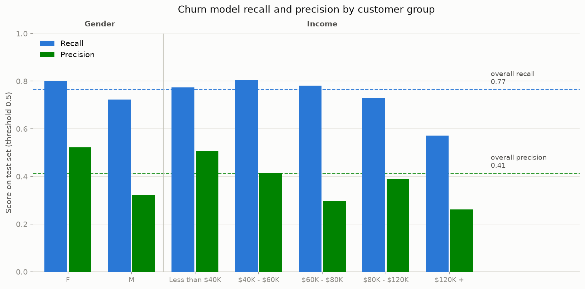

# Bank Churn Model

A credit card churn model that turns a month of customer data into a ranked outreach list sized to a retention team's capacity, with a fairness audit across gender and income.

[](https://github.com/marinasofia/bank-churn-model/actions/workflows/ci.yml)
[](LICENSE)



## Why I built it

A churn score on its own does not tell a retention team what to do on Monday. They can call a fixed number of customers, they need to know why each one is on the list, and they need to know the model treats customer groups evenly. So this project answers three questions: who to call first, why, and whether the list is fair. It reads a CSV, checks it against a strict contract, refuses to score data that has drifted away from what the model learned, and writes a ranked list with up to two reason codes per customer.

## Quickstart

Python 3.12 or newer and [uv](https://docs.astral.sh/uv/).

```sh
git clone https://github.com/marinasofia/bank-churn-model.git
cd bank-churn-model
uv sync --locked --extra dev
uv run pytest -q
```

Score the included dataset and keep the 900 customers most likely to leave:

```sh
mkdir -p outputs
uv run python -m churn.predict bankchurners_clean.csv --capacity 900 --out outputs/outreach.csv
```

## Usage

Pick customers by team capacity or by probability. Exactly one of the two is required.

```sh
# the N customers most likely to churn
uv run python -m churn.predict new_month.csv --capacity 900 --out outreach.csv

# everyone at or above a probability
uv run python -m churn.predict new_month.csv --threshold 0.5 --out outreach.csv

# score even when a feature has drifted past the refuse limit
uv run python -m churn.predict new_month.csv --capacity 900 --force
```

The output has one row per selected customer:

```text
CLIENTNUM, churn_probability, rank, reason_1, reason_2
```

Retrain the model and rerun the fairness audit:

```sh
uv run python -m churn.train --out artifacts
uv run python audit/fairness_audit.py
```

Model artifacts are joblib files, which can run code when loaded, so only load artifacts from sources you trust. The loader also checks that the installed scikit-learn matches the version the model was trained with before it deserializes anything.

## How it works

```text
CSV → input contract → features → drift check (PSI) → score → rank → capacity cut → outreach.csv
```

1. **Input contract.** Every file is validated before scoring: `CLIENTNUM` must be a unique index, features must be numeric, finite and complete, counts must be whole numbers in range, and columns that leak the target are rejected.
2. **Features.** Five behavioral features: total transaction count, change in transaction count from Q1 to Q4, revolving balance, contacts in the last 12 months, and months inactive. Gender and income are left out of the model on purpose.
3. **Drift check.** Each feature is compared with the training distribution using the population stability index. Above 0.20 the run prints a warning. Above 0.50 it stops with exit status 2 unless you pass `--force`.
4. **Scoring and reasons.** A class weighted logistic regression scores each customer. For each row, the features whose contribution pushes the churn probability up the most become `reason_1` and `reason_2`.
5. **Selection.** The list is cut to the team's capacity, or to a probability threshold, with stable handling of ties.

## Results

Measured on a stratified held out test set of 2,026 customers (325 churners), split 80/20 with a fixed seed. The full numbers are in [artifacts/metrics.json](artifacts/metrics.json).

| Measure | Value |
|---|---|
| Test ROC AUC | 0.871 (95% bootstrap interval 0.850 to 0.892, 1,000 resamples) |
| 5 fold cross validated ROC AUC | 0.884 |
| Recall at threshold 0.5 | 0.766, with precision 0.415 |
| Recall when calling 900 customers | 0.889 |
| Baseline: rank by fewest transactions | ROC AUC 0.792 |

**How the list size changes the result** (test set):

| Customers called | Recall | Precision |
|---:|---:|---:|
| 300 | 0.569 | 0.617 |
| 450 | 0.714 | 0.516 |
| 600 | 0.766 | 0.415 |
| 750 | 0.828 | 0.359 |
| 900 | 0.889 | 0.321 |

**Fairness audit** at threshold 0.5, from [audit/fairness_report.json](audit/fairness_report.json):

| Group | Demographic parity difference | Equal opportunity difference |
|---|---:|---:|
| Gender | 0.087 | 0.079 |
| Income | 0.103 | 0.233 |

Demographic parity difference is the largest gap in the share of each group the model flags. Equal opportunity difference is the largest gap in recall, the share of real churners the model catches in each group. The report lists the number of churners behind every group's numbers and a chi squared test of group against actual churn and against the model's flags, so each gap can be read next to the base rates it comes from.

## Design decisions

* **Logistic regression as the scoring model.** A gradient boosting model reached a test ROC AUC of 0.921 and is kept in the metrics as a comparison. Logistic regression scores 0.871 and gives coefficient based reason codes a retention agent can read out loud, which is how the call starts.
* **Class weighting.** About 16% of customers churn, so the model uses balanced class weights to keep the minority class from being ignored during training.
* **Capacity before threshold.** Teams think in calls per month, not probabilities. The default cut is the top N customers, and the capacity table above shows the recall and precision tradeoff at each list size.
* **Two fairness metrics.** Demographic parity checks who gets contacted. Equal opportunity checks whether churners in every group are equally likely to be caught. Gender and income are excluded from the features, and the audit measures whether behavioral features act as proxies for them anyway.
* **Spreadsheet safe output.** The contract rejects identifiers that start with `=`, `+`, `-` or `@`, or that contain control characters, so the outreach CSV cannot carry a formula into Excel.

## Project layout

```text
churn/
  contract.py   input contract, selection rules, atomic output writes
  features.py   the five model features
  drift.py      population stability index per feature
  train.py      training, cross validation, test metrics, comparison models
  predict.py    scoring command line
audit/          fairness audit script, report and chart
artifacts/      saved model, metrics, feature bins, test split index
docs/           scoring contract, technical reference, data provenance
tests/          34 tests
*.ipynb         cleaning, exploration and modeling notebooks
```

## Tests and CI

CI installs the locked environment with uv, runs the 34 tests, retrains the model into a scratch folder to prove training still works, and reruns the fairness audit against the saved model. The tests cover the input contract, selection rules, drift refusal, reason codes, evaluation math and reproducible training.

## Data

The [Credit Card customers dataset](https://www.kaggle.com/datasets/sakshigoyal7/credit-card-customers) by Sakshi Goyal, 10,127 customers. It is CC0 on Kaggle; the uploader sourced it from Analyttica LEAPS. See [data provenance](docs/data-provenance.md).

## More

[Technical reference](docs/technical-reference.md) · [Scoring contract](docs/scoring-contract.md) · [Contributing](CONTRIBUTING.md) · [Security](SECURITY.md)

Python · pandas · scikit-learn · pytest · uv. The code is [MIT licensed](LICENSE).
